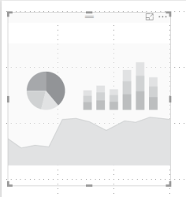
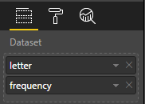
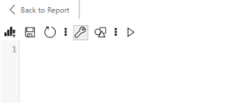

# Power BI D3.js Visual

## D3.js Visual

The D3.js Visual for Power BI provides a D3.js skeleton visual that everybody can use to create custom visuals with D3.js. Either the visual can be created from scratch or an existing D3.js visual can be used via a seamless 'lift-and-shift' procedure.

## Example

<iframe width="100%" height="400" src="https://app.powerbi.com/view?r=eyJrIjoiYzdjMGQ5NjEtYTUyNS00OWNlLWEwNmMtZDQ2NzVkMTg2N2VmIiwidCI6IjE4NzYxNWY1LWFiYmItNDlhZC1iYjhmLTI1MzM2ZmYxZTk3ZSIsImMiOjh9" frameborder="0" style="" onload="let f=document.getElementById('_content');this.height=f.offsetWidth/8*6;" allowFullScreen="true"></iframe>

## Usage

The basic idea behind this visual is to 'lift and shift' an existing D3.js visual and use it with Power BI. Some alterations are need, of course, but basically the dimensions and the data retrieval. Optional it is possible to alter the color assignment based on the provided color array.

All D3.js visuals run in a frame with the following elements/variables:

SVG element:

- `<svg xmlns="http://www.w3.org/2000/svg" class="chart" id="chart">`

`pbi` object:

| Method / Property | Description |
|-------------------|-------------|
| `dsv([accessor,] callback` | function that retrieves the data via the provided callback: pbi.dsv(callback) e.g. `pbi.csv(function(data) { //Process data function });`. Optional `accessor` function may be added. |
| `height` | height of the sandbox frame |
| `width`  | width of the sandbox frame |
| `colors` | color array with 8 colors; changable via options |

The structure of the data returned by the `callback` is based on the data fields that are assigned to the visual, but with some small changes:

- spaces are removed from the names
- names are converted to lowercase

For example a field called `Product Category` will be available for D3.js as `productcategory`.

## Tutorial

To demonstrate this this step by step sample transforms a [D3.js tutorial visual](https://bl.ocks.org/mbostock/3310560).

1. First step is to import the same data [letter-frequency.tsv](https://bl.ocks.org/mbostock/3310560#letter-frequency.tsv) in Power BI via the usual way.

2. Next step is to create a placeholder D3.js visual by importing the custom visual from the Office Store.

    

3. After importing the visual and the data via the fields in the formating pane. The default aggregation of non numeric fields for D3JS visuals is do not summarize. For numeric fields it is set to sum.

    

4. Click on the ... menu of the visual and choose 'Edit'

    

5. An editor screen appears with default the javascript content selected.

    

    > There are 6 menu icons
    >
    > 
    >
    > | Icon  | Description |
    > |-------|-------------|
    > | *New* | Clear the content for a new visual |
    > | *Save* | Saves the current content |
    > | *Reload* | Reloads the last saved version of the current content |
    > | *Code* | Toggle for the Code content view |
    > | *Style* | Toggle for the Style content view |
    > | *Parse* | Parse the javascript code to check for errors |

6. In the `Code` editor paste the script part of the sample starting at : `var margin...`.

7. Alter the lines related to the width and height of the visual as the height and width are fixed in the sample. And with Power BI this is not needed and can be change depending the size of the placeholder.
    Example: `width = pbi.width - margin.left - margin.right,`

8. Other important step is to replace the selection of the SVG element. Replace ~~`var svg = d3.select("body").append("svg")`~~ for `var svg = d3.select("#chart")` as this is the only supported way of setting the correct svg variable.

9. Also the d3.tsv (or d3.csv) import function need to be changed as this option will not use the data from Power BI. Alter the corresponding line and replace it with the `pbi.dsv()` function. With this variant there is not reference to the data needed and also not a type conversion. So replace ~~`d3.tsv("letter-frequency.tsv", type, function(error, letters) {`~~ for `pbi.dsv(type, function(letters) {`

10. After clicking `Save` click on the 'Style' icon in the menu to add the CSS code from the tutorial to this visual.

11. Last step is to also `Save` the style content and then click 'Return to report' to see the visual.

## Limitations

Unfortunately the following limitations are valid for this visual:

- Available D3.js version is v3.5.17
- Maximum amount of datapoints is: 30,000
- Due to the way of the visual is rendered the main SVG element must be selected via the id, e.g. `d3.select("#chart")` and should not be created via code
- The JavaScript code should be ES5 code as that is the supported version by Power BI
- After editing the visual content and returning back to visual the edit option of the menu is sometimes not available any more. Refreshing the data/visuals will resolve this.
- There is no warning when the link 'Back to the report' is clicked and unsaved content is available in the editor. Please be advised and save regular.

## Sample

A sample file can be downloaded at: https://github.com/liprec/powerbi-d3jsvisual/releases/download/v1.1.0/D3jsVisual.Sample.pbix

## Changelog

See for the list of changes [here](xref:pbi/d3js/changelog).

## Feedback

### [**Documentation**](#tab/docs)

If you have any comment related to the documentation, like corrections, unclear features or missing documentation, feel free to leave feedback below via GitHub. Or correct it yourself and submit a PR; see [CONTRIBUTING.md](https://github.com/liprec/azurebi-docs/blob/master/.github/CONTRIBUTING.md) for more details.
*GitHub account required.*

### [**Product**](#tab/product)

If you have any comment related to the working of the described product, feel free to leave feedback below via GitHub.
*GitHub account required.*

***

### [**Open**](#tab/docs-open/docs)

### [**Closed**](#tab/docs-closed/docs)

### [**Open**](#tab/product-open/product)

### [**Closed**](#tab/product-closed/product)

***
