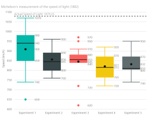

# Power BI Custom Visuals

Overview of my Power BI custom visuals available in [AppSource](https://appsource.microsoft.com/en-us/marketplace/apps?product=power-bi-visuals&page=1).

## General

- [Privacy terms](xref:privacy-terms.md)
- [Explanation of Power BI and Azure CDN](https://azurebi.jppp.org/2016/07/20/power-bi-visuals-delivered-via-azure-cdn/)
- [Visual Studio Code extension for easy development](xref:vscode/pbiviz/overview)

## Box and Whisker chart

Visualize a dataset as a box and whisker chart. A box and whisker chart shows basic statistical information of a dataset: the 1st and 3rd quartile (box), the median (line), the mean (dot) and dependent of the type either the minimum and maximum value of all values or between the 1.5x interquartile range [IQR] (whiskers).

- [Overview](xref:pbi/boxandwhisker/overview)
- [Changelog](xref:pbi/boxandwhisker/changelog)
- [AppSource listing](https://appsource.microsoft.com/product/power-bi-visuals/WA104380831?src=website&mktcmpid=overview)

## Hierarchy Slicer

With the hierarchy slicer it is possible to represent a hierarchy as a single slicer. The different levels are shown as a tree.

- [Overview](xref:pbi/hierarchyslicer/overview)
- [Changelog](xref:pbi/hierarchyslicer/changelog)
- [AppSource listing](https://appsource.microsoft.com/product/power-bi-visuals/WA104380820?src=website&mktcmpid=overview)

## D3.js Visual

The D3.js Visual for Power BI provides a D3.js skeleton visual that everybody can use to create custom visuals with D3.js. Either the visual can be created from scratch or an existing D3.js visual can be used via a seamless 'lift-and-shift' procedure.

- [Overview](xref:pbi/d3js/overview)
- [Changelog](xref:pbi/d3js/changelog)
- [AppSource listing](https://appsource.microsoft.com/en-us/product/power-bi-visuals/WA104381354?src=website&mktcmpid=overview)

## Support
 
Do you like my free community extensions? Please consider supporting me on [Flattr](https://flattr.com.@liprec) so I can reserve more time in keeping them running and adding more features.

## Feedback

If you have any comment related to the documentation, like corrections, unclear features or missing documentation, feel free to leave feedback below via GitHub. Or correct it yourself and submit a PR; see [CONTRIBUTING.md](https://github.com/liprec/azurebi-docs/blob/master/.github/CONTRIBUTING.md) for more details.
*GitHub account required.*

### [**Open**](#tab/docs-open)

### [**Closed**](#tab/docs-closed)

***
