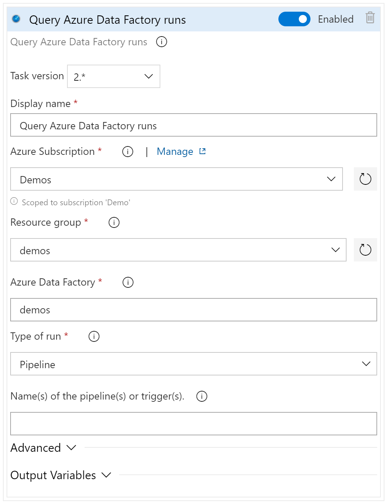

# Query Azure Data Factory runs

This release task can be added to a release pipeline to obsorve active Azure Data Factory runs. This task can run as a serverless task or configured as [Gate](https://docs.microsoft.com/en-us/azure/devops/pipelines/release/approvals/gates?view=azure-devops&WT.mc_id=DP-MVP-5003419)


### [**YAML**](#tab/yaml)

> [!NOTE]
> Currently the YAML definitions do not support the 're-evaluation' options of gates

## YAML Snippet

```yaml
# Query Azure Data Factory runs
# Observe the configured Azure Data Factory runs for active ones
- task: query-adf-run@2
  displayName: 'Query Azure Data Factory runs'
  inputs:
    #azureSubscription: # Required
    #resourceGroupName: # Required
    #datafactoryName: # Required
    #runType: 'pipeline' # Options: pipeline, trigger
    #name: # Optional
    #statusPipeline: 'Cancelled,Failed,InProgress,Queued'
    #lastUpdatedAfter: # Optional
    #lastUpdatedBefore: # Optional
    #result: # Optional

```

## Arguments

| Argument | Description |
|----------|-------------|
| `azureSubscription`<br>Azure subscription | (Required) Name of Azure Resource Manager service connection.|
| `resourceGroupName`<br>Resource group | (Required) Name of the Resource Group containing the Data Factory.|
| `datafactoryName`<br>Azure Data Factory | (Required) Name of the Data Factory.|
| `runType`<br>Type of run | (Required) Type of the Azure Data Factory run: Pipeline (default) or Trigger.|
| `name`<br>Name(s) of the pipeline(s) or trigger(s). | Name(s) of the pipeline(s) or trigger(s). Multiple names seperated by commas (,). If not provided all pipelines / triggers are queried|
| `statusPipeline`<br>Pipeline filter for the run status | (Optional) Filter by pipeline status. Default value is all status except 'Succeeded'. |
| `lastUpdatedAfter`<br>Start time of the run event window | (Optional) The time at or after which the run event was updated in 'ISO 8601' format. Default value is Januari 1st, 2000. |
| `lastUpdatedBefore`<br>End time of the run event window | (Optional) The time at or before which the run event was updated in 'ISO 8601' format. Default value is December 31st, 2199 |
| `result`<br>Expected results | (Optional) Option to determine if the result should contain result (runs). Default value: 'false' |

### [**Classic**](#tab/classic)



## Arguments

| Argument | Description |
|----------|-------------|
| Azure subscription | (Required) Name of Azure Resource Manager service connection.|
| Resource group | (Required) Name of the Resource Group containing the Data Factory.|
| Azure Data Factory | (Required) Name of the Data Factory.|
| Type of run | (Required) Type of the Azure Data Factory run: Pipeline (default) or Trigger.|
| Name(s) of the pipeline(s) or trigger(s). | Name(s) of the pipeline(s) or trigger(s). Multiple names seperated by commas (,). If not provided all pipelines / triggers are queried|
| Pipeline filter for the run status | (Optional) Filter by pipeline status. Default value is all status except 'Succeeded'. |
| Start time of the run event window | (Optional) The time at or after which the run event was updated in 'ISO 8601' format. Default value is Januari 1st, 2000. |
| End time of the run event window | (Optional) The time at or before which the run event was updated in 'ISO 8601' format. Default value is December 31st, 2199 |
| Expected results | (Optional) Option to determine if the result should contain result (runs). Default value: 'false' |

***

> [!TIP]
> For the 'Start time of the run event window' (`lastUpdatedAfter`) the pipeline variable `$(Release.Deployment.StartTime)` can be used to query for events that happen after the pipeline is started

## Release notes

### 2.2

- Initial public release

## Feedback

If you have any comment related to the documentation, like corrections, unclear features or missing documentation, feel free to leave feedback below via GitHub. Or correct it yourself and submit a PR; see [CONTRIBUTING.md](https://github.com/liprec/azurebi-docs/blob/master/.github/CONTRIBUTING.md) for more details.
*GitHub account required.*

### [**Open**](#tab/docs-open)

### [**Closed**](#tab/docs-closed)

***
